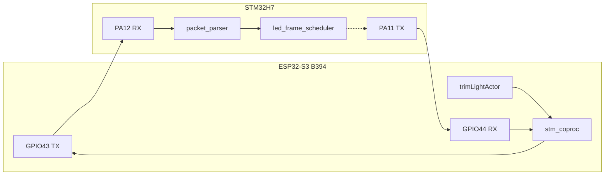

# ESP–STM Communication Plan (LED Offload) — B394

## Target hardware

| Item | Value |
|------|-------|
| Board | **B394** (`CONFIG_HARDWARE_B394=y` → `-DB394`, firmware `Auto_Link_Firmware_*`) |
| ESP | ESP32-S3 in [HavenB480-main_11](c:\Sanjeev_work\working code\X_series\HavenB480-main_11) |
| STM | STM32H7 in [XseriesAddressable](c:\Sanjeev_work\working code\XseriesAddressable\XseriesAddressable) |
| Schematic | [B541_RevC5.PDF](C:\Sanjeev_work\Hardware\ESP_STM\B541_RevC5.PDF) (shared ESP+STM reference) |

### UART cross-connect (B394 — confirmed)

| Signal | ESP32-S3 | STM32H7 UART4 |
|--------|----------|---------------|
| ESP TX → STM RX | **GPIO43** | **PA12** |
| ESP RX ← STM TX | **GPIO44** | **PA11** |
| Ground | GND | GND |



**Important:** Current STM CubeMX project assigns **PA11 = RX, PA12 = TX** ([XseriesAddressable.ioc](c:\Sanjeev_work\working code\XseriesAddressable\XseriesAddressable\XseriesAddressable.ioc)). That is **opposite** to the B394 board. Phase 1 must **swap UART4 pins** in [usart.c](c:\Sanjeev_work\working code\XseriesAddressable\XseriesAddressable\Core\Src\usart.c) and `.ioc` so firmware matches hardware:

- **PA11 = UART4_TX**
- **PA12 = UART4_RX**

---

## Current state

| Layer | ESP (B394 build) | STM |
|-------|------------------|-----|
| Build flag | `B394` via [CMakeLists.txt](c:\Sanjeev_work\working code\X_series\HavenB480-main_11\CMakeLists.txt) `CONFIG_HARDWARE_B394` | XseriesAddressable |
| LED output | **No active RMT task for B394** — `LEdRunningmonitor` is gated to `B480 \|\| B553 \|\| B543` only; B394 has GPIO defines (6/5) in [trimLightActor.c](c:\Sanjeev_work\working code\X_series\HavenB480-main_11\main\trimLightActor.c) but no init/send path | TIM2 DMA → 4 addressable channels |
| UART to STM | GPIO43/44 @ 460800 **defined but never initialized** (lines 89–92) | UART4 @ **115200**, wrong pin assignment vs B394 |
| Other B394 actors | [B394_DigitalInput.c](c:\Sanjeev_work\working code\X_series\HavenB480-main_11\main\B394_DigitalInput.c) — 8 DIs on GPIO 15–18, 21, 39, 47, 48 | — |
| Protocol | `Coproc_Actor.c` / `Interface.c` commented out | Binary `0x5AA5` frames in [packet_parser.c](c:\Sanjeev_work\working code\XseriesAddressable\XseriesAddressable\Core\Src\packet_parser.c) |

**B394 implication:** LED offload is not a “swap RMT for UART” — it is **adding the first real LED output path** on B394, with all strip driving on STM.

---

## Phase 0 — Hardware verification

Confirm on schematic / bench:

- **ESP GPIO43 = TX**, **GPIO44 = RX** (matches existing [trimLightActor.c](c:\Sanjeev_work\working code\X_series\HavenB480-main_11\main\trimLightActor.c) defines)
- **STM PA12 = RX**, **PA11 = TX** (requires STM firmware pin swap — see above)
- Common GND between ESP and STM domains
- 3.3 V logic levels (no shifter on UART nets)
- STM LED outputs (TIM2 CH1–CH4) route to physical strips — not ESP GPIO 6/5

**Deliverable:** pin table comment in `xseries_uart_protocol.h` / `stm_coproc.h`.

---

## Phase 1 — Shared protocol + STM bring-up @ 460800

### 1a. Shared header (both repos)

Create identical `xseries_uart_protocol.h` in:

- [XseriesAddressable/Core/Inc/](c:\Sanjeev_work\working code\XseriesAddressable\XseriesAddressable\Core\Inc)
- [HavenB480-main_11/main/](c:\Sanjeev_work\working code\X_series\HavenB480-main_11\main)

```
Frame: [SOF:2][LEN:2][CMD:2][SEQ:2][PAYLOAD:LEN][CRC:2]  (all LE)
SOF = 0x5AA5
CRC = CRC-16/CCITT over LEN+CMD+SEQ+PAYLOAD (poly 0x1021, init 0xFFFF)
```

| CMD | Value | STM status |
|-----|-------|------------|
| SET_SOLID | 0x0001 | Implemented |
| SET_CHANNEL_FRAME | 0x0002 | Stub — implement |
| SET_FULL_FRAME | 0x0003 | Stub — implement |
| SET_BRIGHTNESS | 0x0004 | Implemented |
| START/STOP_EFFECT | 0x0005/6 | Implemented |
| TEST_PATTERN | 0x000A | Implemented |
| READ_STATUS | 0x000B | No TX yet |
| FRAME_COMMIT | 0x000C | New — commit chunked frame |

### 1b. Chunked frame transfer

`UART_MAX_PAYLOAD = 256` — use chunked `SET_CHANNEL_FRAME`:

```
[lane: u8][offset_px: u16][count: u8][pixels: count × 6 bytes RGB16]
```

Max 42 pixels/packet; 128 LEDs/channel → 4 packets + `FRAME_COMMIT`.

### 1c. LED count alignment

Cap ESP `SetLEDstripalChN` to **128** when `USE_STM_COPROC` (match STM `LEDS_PER_CHANNEL`).

### 1d. STM changes

1. **Pin swap:** PA11 = TX, PA12 = RX in [usart.c](c:\Sanjeev_work\working code\XseriesAddressable\XseriesAddressable\Core\Src\usart.c) + [XseriesAddressable.ioc](c:\Sanjeev_work\working code\XseriesAddressable\XseriesAddressable\XseriesAddressable.ioc)
2. **Baud:** 115200 → **460800**

---

## Phase 2 — STM firmware completion

### 2a. UART TX

Add `UART4_WriteBlocking()` and `uart_tx_send_packet()` for `READ_STATUS` responses and optional `FRAME_COMMIT` ACK.

### 2b. Frame command handlers

In [command_dispatch.c](c:\Sanjeev_work\working code\XseriesAddressable\XseriesAddressable\Core\Src\command_dispatch.c):

- `SET_CHANNEL_FRAME` → write into `g_back_frame[lane]`
- `FRAME_COMMIT` → `frame_scheduler_request_commit()`

### 2c. Main loop

Unchanged: pull → parse → dispatch → `frame_scheduler_task()` in [main.c](c:\Sanjeev_work\working code\XseriesAddressable\XseriesAddressable\Core\Src\main.c).

---

## Phase 3 — ESP `stm_coproc` module

New files: `stm_coproc.c/h`, `xseries_uart_protocol.h` in [main/](c:\Sanjeev_work\working code\X_series\HavenB480-main_11\main).

```c
#if defined(B394)
#define STM_COPROC_UART_NUM     UART_NUM_1   // or UART_NUM_0 if console unused
#define STM_COPROC_TX_PIN       GPIO_NUM_43
#define STM_COPROC_RX_PIN       GPIO_NUM_44
#define STM_COPROC_BAUD         460800
#endif
```

- RX event task + ring buffer
- Mutex-protected TX with monotonic `seq`
- Reuse [Config.h](c:\Sanjeev_work\working code\X_series\HavenB480-main_11\main\Config.h) `COUA_UART2_EVENT_TASK_*` stack/priority names
- Add `stm_coproc.c` to [main/CMakeLists.txt](c:\Sanjeev_work\working code\X_series\HavenB480-main_11\main\CMakeLists.txt)

**Public API:**

```c
esp_err_t stm_coproc_init(void);
esp_err_t stm_coproc_send_solid(uint8_t lane, uint16_t r, g, b);
esp_err_t stm_coproc_send_channel_frame(uint8_t lane, uint16_t offset, const uint16_t *rgb, uint16_t count);
esp_err_t stm_coproc_frame_commit(void);
esp_err_t stm_coproc_set_brightness(uint8_t b);
bool      stm_coproc_link_ok(void);
```

---

## Phase 4 — trimLightActor integration (B394)

### 4a. Compile-time switch

```c
#if defined(B394)
#define USE_STM_COPROC 1
#endif
```

Do **not** gate on B480/B553 for this project — B394 is the target board.

### 4b. B394-specific LED output task

B394 is **not** in the existing RMT path:

```2172:2177:c:\Sanjeev_work\working code\X_series\HavenB480-main_11\main\trimLightActor.c
#if defined (B480) || defined (B553) || defined (B543)
		for(i=0;i<NUMBER_OF_CHANNELS;i++)
		{
			configure_and_enable_rmt_channels(i);
		}
		init_data_channels();
```

**Add for B394:**

1. In `init()`: call `stm_coproc_init()`, `init_data_channels()`, probe `CMD_READ_STATUS`
2. Start a new task (e.g. `LEdRunningmonitor_STM` or extend `#if defined(B394)` block) that mirrors the B480 refresh loop logic but:
   - Runs `CalculateDataBuffers()` as today (effect math stays on ESP)
   - Sends frames via `stm_coproc_send_channel_frame()` + `stm_coproc_frame_commit()`
   - **Does not** call `configure_and_enable_rmt_channels()` or `send_rmt_data()`
3. Reuse `channel_equal()`, `flag_not_rmt`, `delay_same_array` to skip unchanged frames
4. Register task in the same `#if defined(B394)` init block as `LEdRunningmonitor` equivalent (~line 2194)

### 4c. GPIO note

B394 RMT pin defines (GPIO 6/5) in trimLightActor are **unused** when `USE_STM_COPROC` — physical strips are on STM TIM2 outputs. No ESP GPIO conflict with [B394_DigitalInput.c](c:\Sanjeev_work\working code\X_series\HavenB480-main_11\main\B394_DigitalInput.c) inputs (15–18, 21, 39, 47, 48).

### 4d. Optional RMT fallback

Not needed for B394 v1 (no prior RMT output path). Can add `#if !USE_STM_COPROC` later for bench boards without STM.

---

## Phase 5 — Throughput and timing

460800 8N1 ≈ 46 KB/s. Full 4×128 LED frame ≈ 3.3 KB wire + STM DMA TX — fits **10 Hz** `LED_TASK_RATE` with margin. Skip unchanged channels via existing `channel_equal()` logic.

---

## Phase 6 — Test matrix (B394 hardware)

| Step | Action | Pass |
|------|--------|------|
| 1 | Logic analyzer: ESP GPIO43 ↔ STM PA12, GPIO44 ↔ PA11 @ 460800 | Framing valid |
| 2 | ESP → `CMD_TEST_PATTERN_MODE` | 4 STM channels show patterns |
| 3 | ESP → `CMD_SET_SOLID` per lane | Correct solid colors |
| 4 | Chunked `SET_CHANNEL_FRAME` + commit | 128-LED gradient |
| 5 | trimLight playlist on B394 build | Visual output via STM strips |
| 6 | UART disconnect mid-run | ESP logs fault; no WDT panic |
| 7 | `CMD_READ_STATUS` | Diag counters; `parser_crc_fail == 0` |
| 8 | B394 digital inputs still work | No regression in B394_DI actor |

---

## Implementation order

1. Confirm B394 UART wiring on bench (Phase 0)
2. STM pin swap (PA11=TX, PA12=RX) + baud 460800 (Phase 1d)
3. Shared `xseries_uart_protocol.h` (Phase 1a)
4. STM TX + frame handlers (Phase 2)
5. ESP `stm_coproc` module (Phase 3)
6. B394 trimLight LED task + stm_coproc output (Phase 4)
7. Test matrix on B394 (Phase 6)

---

## Risks

- **STM CubeMX pin inversion:** Failure to swap PA11/PA12 in firmware will produce garbage on B394 even if ESP pins are correct.
- **B394 has no existing LED output task:** More integration work than B480 (new task path, not just RMT swap).
- **LED count (1024 vs 128):** Cap at 128 for v1.
- **STM single point of failure:** All strip output depends on STM link; `stm_coproc_link_ok()` should surface faults to cloud/console.

## Out of scope (this phase)

- B480/B553 RMT → STM migration (can reuse `stm_coproc` later)
- STM OTA via ESP (`/status_stm` UI has no backend)
- Raising `LEDS_PER_CHANNEL` above 128 on STM
