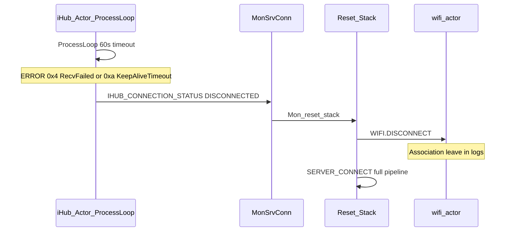
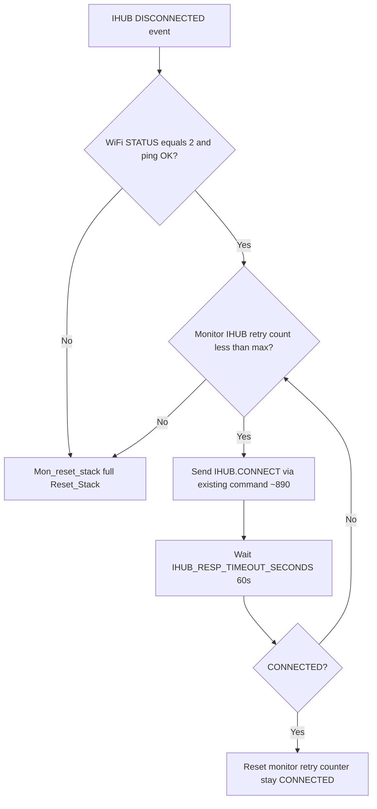

# Prevent WiFi / IHUB Disconnect

## Problem summary (from field logs)

Disconnects are **not** caused by bad IHUB credentials. The dominant pattern is:



Most `WIFI DISCONNECTED` / `Association leave` entries are **side effects** of [`Reset_Stack()`](main/SYSTEM_Actor.c) (lines 3737–3761), not the root cause. Full reset turns a ~20s MQTT blip into a ~1–120 min outage when scans, Device Announce HTTP, or weak AP (`SAT1_EXT`) collide during reconnect.

**Chosen recovery strategy:** In-task IHUB retry with backoff first; **full `Reset_Stack` only if retries are exhausted** (or WiFi/link is actually down).

---

## Baseline: already in tree (verify + deploy)

Confirm these are in the build you ship to field (704.22+):

| Fix | File | What it prevents |
|-----|------|------------------|
| Skip scan when connected | [`wifi_actor.c`](main/wifi_actor.c) ~3308 | 1400+ scans/log on 704.21; OTA/HTTP races |
| RSSI threshold -90 | [`wifi_actor.c`](main/wifi_actor.c) ~1910 | Marginal AP association |
| `esp_wifi_set_inactive_time` 30s | [`wifi_actor.c`](main/wifi_actor.c) ~1839 | Premature STA idle disconnect |
| IHUB connect retries 10 / 30s max | [`iHub_Actor.c`](main/iHub_Actor.c) ~131–137 | Slow initial TLS connect |
| `Delete_task_flag` before ProcessLoop | [`iHub_Actor.c`](main/iHub_Actor.c) ~2774+ | Use-after-teardown |
| `IHUB_CONNECTED` at end of `Connect_IHUB` | [`iHub_Actor.c`](main/iHub_Actor.c) ~3664 | False “stuck connecting” |
| NTP sync status set | [`NTP_Actor.c`](main/NTP_Actor.c) ~699 | SAS/token timing issues |

**Field checklist (no code):** prefer direct AP (`SAT1`, RSSI better than -65) over extenders (`SAT1_EXT`); ensure all units on 704.22+.

---

## Phase 1 — In-task IHUB retry before broadcasting DISCONNECTED (highest impact)

**Target:** [`iHub_Actor.c`](main/iHub_Actor.c) `vStartDemoTask` ProcessLoop failure block (~2778–2867) and stale-connection path (~2876–2888).

**Current behavior:** One `ProcessLoop` failure immediately sets `Delete_task_flag`, emits `IHUB_CONNECTION_STATUS: DISCONNECTED`, tears down MQTT/TLS, and exits the task — monitor then forces full stack reset.

**New behavior:**

1. On `ProcessLoop` failure (`xResult != eAzureIoTSuccess`):
   - Increment a static retry counter (reset to 0 on successful ProcessLoop).
   - **Do not** broadcast `DISCONNECTED` or exit on first failure.
   - Log `ERROR_NUM` + human-readable error to audit log only (internal retry).

2. **Error-specific recovery inside the task** (reuse existing helpers):
   - `eAzureIoTErrorMQTTTimeout` (0xa): call existing SAS refresh path (~2845–2864), then `Disconnect_IHUB` + `Connect_IHUB` (same pattern as [`Azure_RefreshToken_IfExpiring`](main/iHub_Actor.c) ~3711–3713).
   - `eAzureIoTErrorFailed` / recv failed (0x4): `TLS_Socket_Disconnect`, short backoff (`sampleazureiotRETRY_BACKOFF_BASE_MS` → `MAX_BACKOFF_DELAY_MS`), then `Connect_IHUB` without deiniting WiFi/HTTP actors.

3. **Retry budget:** Reuse `sampleazureiotRETRY_MAX_ATTEMPTS` (10) and `sampleazureiotRETRY_MAX_BACKOFF_DELAY_MS` (30s) for consistency with initial connect.

4. **Only after budget exhausted:** Keep today’s teardown (unsubscribe, disconnect, `IHUB_CONNECTION_STATUS: DISCONNECTED`, `ERROR_NUM` in JSON) so monitor can escalate.

5. **Stale MQTT path** (`Azure_MQTTContextIsStale`, ~2876): Same retry loop instead of immediately setting `Delete_task_flag` and broadcasting DISCONNECTED.

**Guardrails:**
- Honor `Delete_task_flag` / `DEINIT` during retry waits (existing ~2774 check).
- Set `iHub_Para.conn_status` to `IHUB_CONNECTION_IN_PROGRESS` during retry; only `IHUB_DISCONNECTED` after final failure.
- Avoid double `vTaskDelete` on `vStartDemoTask_handle` (existing bug pattern at ~2866–2867: null handle before delete).

---

## Phase 2 — Monitor: retry IHUB before `Mon_reset_stack`

**Target:** [`SYSTEM_Actor.c`](main/SYSTEM_Actor.c) `MonSrvConn` IHUB DISCONNECTED handler (~3882–3925) and [`Mon_reset_stack`](main/SYSTEM_Actor.c) (~4045).

**Current behavior:** Any `IHUB_CONNECTION_STATUS: DISCONNECTED` event → `Mon_reset_stack` → `Reset_Stack` → `WIFI.DISCONNECT` + full `SERVER_CONNECT`.

**New behavior:**



1. Add static `ihub_monitor_retry_count` (cap at 3–5, separate from in-task retries).
2. On DISCONNECTED, parse `ERROR_NUM` if present (~3896).
3. Query WiFi status (`WIFI.GET` / cached `WIFI_STATUS` from monitor state ~4083). If `WIFI_STATUS == 2` (connected):
   - If `ihub_monitor_retry_count < IHUB_MONITOR_RETRY_MAX`: send `IHUB.CONNECT` ([`iHub_Connect`](main/iHub_Actor.c) ~890), wait up to [`IHUB_RESP_TIMEOUT_SECONDS`](main/SYSTEM_Actor.c) (60s), **do not** call `Reset_Stack`.
   - On success: reset counter, resume normal monitor idle/check cycle.
4. If WiFi down, ping/DA failed, or monitor retries exhausted → `Mon_reset_stack` (unchanged full reset).

**WiFi disconnect path (~3879):** Unchanged — real link loss still gets full reset.

**Doc update:** Revise [`docs/Connection_Stability_Improvements.md`](docs/Connection_Stability_Improvements.md) “Full reset on all failures” section to document this **IHUB-only exception** while keeping full reset for `STATE_FAILED_*`, WiFi down, and exhausted IHUB retries.

---

## Phase 3 — Gate background WiFi scan during critical work

**Target:** [`wifi_actor.c`](main/wifi_actor.c) `wifi_scan_task` (~3300–3325).

**Problem:** Even with `if (!wifi_connected)`, scans still run during `SERVER_CONNECT` (WiFi may flap), Device Announce HTTP POST, and OTA `HTTP.FETCH_FILE` — causing `ESP_ERR_HTTP_CONNECT`, `NETWORK: NOT AVAILABLE`, and ESP32 panics (folders 5/6 on 704.21).

**New behavior:** Introduce a small shared flag (e.g. `connection_busy` or reuse existing actor status):

- Set busy when [`Server_Connect`](main/SYSTEM_Actor.c) is between `STATE_CHECK_CREDENTIALS` and `STATE_CONNECTED`.
- Set busy when [`HTTP_Actor`](main/HTTP_Actor.c) `Connection_status` is active during `FETCH_FILE` / DA POST.
- In `wifi_scan_task`: skip `wifi_scan()` when `wifi_connected || connection_busy`.

Expose read-only status in WiFi GET/audit if useful for field debug.

---

## Phase 4 — Remaining stability fixes

### 4a. Cap Device Announce exponential backoff

[`SYSTEM_Actor.c`](main/SYSTEM_Actor.c) ~2664–2670 doubles `Device_Announce_F_delay_u32` each failed cycle (`2*temp_d`) with no hard cap — LOG00116 saw multi-hour DA delays.

```c
// After computing new delay:
uint32_t new_delay = 2 * temp_d;
if (new_delay > 300) new_delay = 300;  // 5 min cap
ACTOR_SYSTEM_Para.Device_Announce_F_delay_u32 = new_delay;
```

Reset delay to 0 on `STATE_CONNECTED` / successful DA (verify [`handle_device_announce`](main/SYSTEM_Actor.c) success path).

### 4b. Telemetry: distinguish reset vs real WiFi loss

When emitting IHUB DISCONNECTED after retries, add optional field e.g. `RECOVERY_STAGE: "IN_TASK_EXHAUSTED"` vs monitor `"MONITOR_EXHAUSTED"`.

On WiFi disconnect audit, tag `DISCONNECT_REASON: "STACK_RESET"` when initiated from `Reset_Stack` vs driver events (`beacon timeout`, etc.) — simplifies future log triage.

### 4c. Optional tuning (lower priority)

- Consider reducing `sampleazureiotPROCESS_LOOP_TIMEOUT_MS` from 60000 to 10000–15000 on ESP32 production builds ([`iHub_Actor.c`](main/iHub_Actor.c) ~168) so stale connections are detected faster without blocking the task for a full minute.
- Keep MQTT keepalive / `PING_INTERVAL` aligned with Azure SDK defaults after retry logic is stable.

---

## Phase 5 — Test matrix

| Scenario | How to trigger | Pass criteria |
|----------|----------------|---------------|
| Transient MQTT recv fail | Block Azure egress briefly (firewall) while WiFi up | In-task retry succeeds; no `WIFI.DISCONNECT`; cloud online within ~30–60s |
| Keepalive timeout 0xa | Idle device / NAT timeout simulation | SAS refresh + reconnect in-task; no full reset |
| In-task retries exhausted | Extended Azure block (>5 min) | DISCONNECTED once; monitor sends `IHUB.CONNECT` up to N times; WiFi stays up |
| Monitor retries exhausted | IHUB CONNECT fails repeatedly | Single `Reset_Stack`; full `SERVER_CONNECT`; recovers |
| Real WiFi loss | Disable AP or weak RSSI | `Mon_reset_stack` without IHUB-only retry |
| OTA + scan | `HTTP.FETCH_FILE` during reconnect | No concurrent `wifi_scan`; no panic |
| DA backoff | Repeated DA HTTP failures | Delay caps at 300s; does not grow to hours |

**UART / cloud commands:** `<IHUB.GET({"Property_Names":["STATUS"]})>`, `<SYSTEM.STACK_RESET()>`, `<WIFI.GET(...)>`; cloud `ExecuteCommand` with same console strings.

**Log markers to verify:** fewer `Association leave` after single `ProcessLoop failed`; `IHUB_CONNECTION_STATUS CONNECTED` without preceding `HTTP DEINIT` / `WIFI DISCONNECT` for blip scenarios.

---

## Implementation order

1. **Phase 1** — in-task retry (biggest reduction in unnecessary disconnects)
2. **Phase 2** — monitor guarded reset (safety net without tearing down WiFi)
3. **Phase 3** — scan/OTA gating (prevents reconnect amplification and crashes)
4. **Phase 4a** — DA backoff cap (prevents LOG00116-style multi-hour stalls)
5. **Phase 4b–c** — telemetry and optional timeout tuning
6. **Phase 5** — regression test matrix on HW + staged field rollout

## Risk notes

- **Partial recovery complexity:** Mitigated by keeping a single escalation ladder (in-task → monitor IHUB.CONNECT → full reset) and updating [`Connection_Stability_Improvements.md`](docs/Connection_Stability_Improvements.md).
- **Re-entrancy:** `IHUB.CONNECT` while `vStartDemoTask` is exiting must be serialized via `conn_status` / `Delete_task_flag` checks (already partially present ~892–906).
- **Do not** remove full reset for WiFi/ETH failures or `STATE_FAILED_*` — only narrow the IHUB+WiFi-up case.
